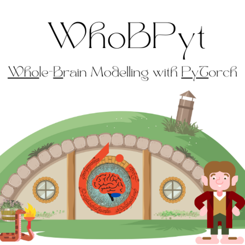

.. title:: WhoBPyT

.. The page title must be in rST for it to show in next/prev page buttons.
   Therefore we add a special style rule to only this page that hides h1 tags

.. raw:: html

    

WhoBPyT Homepage
===================

.. LOGO

.. image:: _static/whobpyt_logo_feet_dark.png
   :alt: WhoBPyT
   :class: logo, mainlogo, only-dark
   :align: center

.. rst-class:: text-center font-weight-light my-4
   
*WhoBPyT* is a PyTorch-based Python library for mathematical modelling of large-scale brain network dynamics, obtuse literary allusion, and model-based analysis of neuroimaging and neurophysiology data. It is developed primarily by researchers in the `Whole-Brain Modelling <https://www.grifflab.com>`_ and `Cognitive Network Modelling <https://www.cognemo.com>`_ groups at the `CAMH Krembil Centre for Neuroinformatics <https://www.krembilneuroinformatics.ca>`_ & University of Toronto. 
The general philosophical/theoretical perspective on brain organization that WhoBPyT represents, called 
(surprise surprise) *Whole-Brain Modelling*, is reviewed in 
`this paper <https://www.grifflab.com/publication/2022-griffiths-et-al-wbm-pastpresentfuture/>`_. 

The specific methodological approach to this that WhoBPyT uses incorporates elements of modern deep learning, 
nonlinear control, and dynamical systems theory, and was first described by us 
`here <https://www.grifflab.com/publication/2022-griffiths-et-al-deeplearningbasedparameterestimation/>`_ 
and `here <https://www.grifflab.com/publication/2023-momi-et-al-tmsevokedresponses/>`_. Consult the 
docs :doc:`docs <documentation/about>`, the `code <https://www.github.com/GriffithsLab/WhoBPyT>`_, 
and :doc:`papers using WhoBPyT <documentation/about/cited>` for more info on scientific background, 
mathematical foundations, and technical implementation. 

**To jump straight in**, follow the :doc:`installation instructions <documentation/usage/installation>`, 
and then explore some of the detailed worked examples linked to below and in the 
:doc:`examples gallery <auto_examples/>`. 

.. frontpage gallery is added by a conditional in _templates/layout.html

.. toctree::
   :hidden:

   About <documentation/about/index>
   Documentation <documentation/index>
   Science <documentation/science/index>  
   Contribute <documentation/development/index>  
   Examples <documentation/../../examples/index>